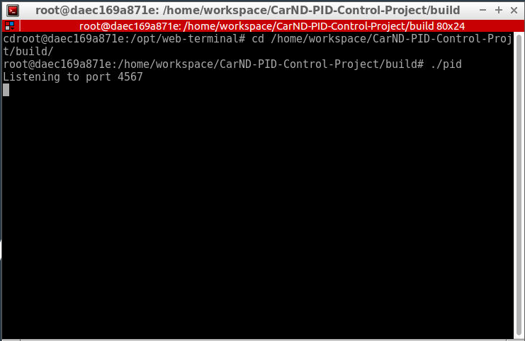
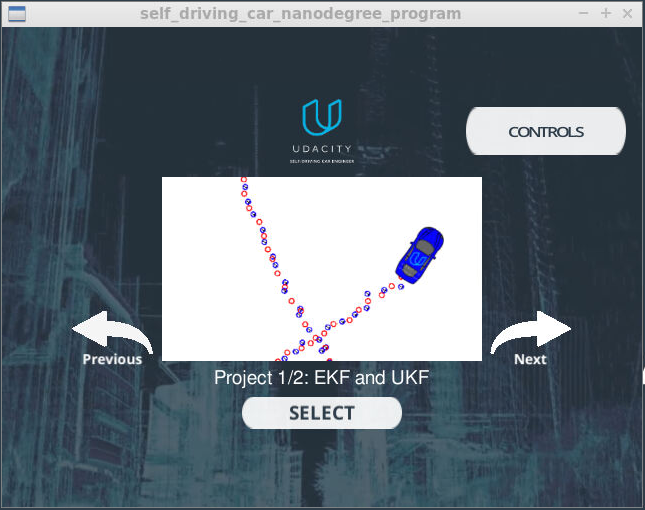
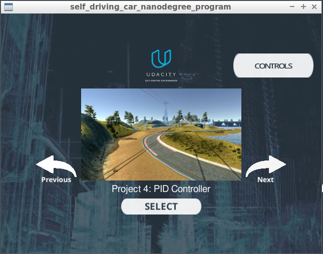
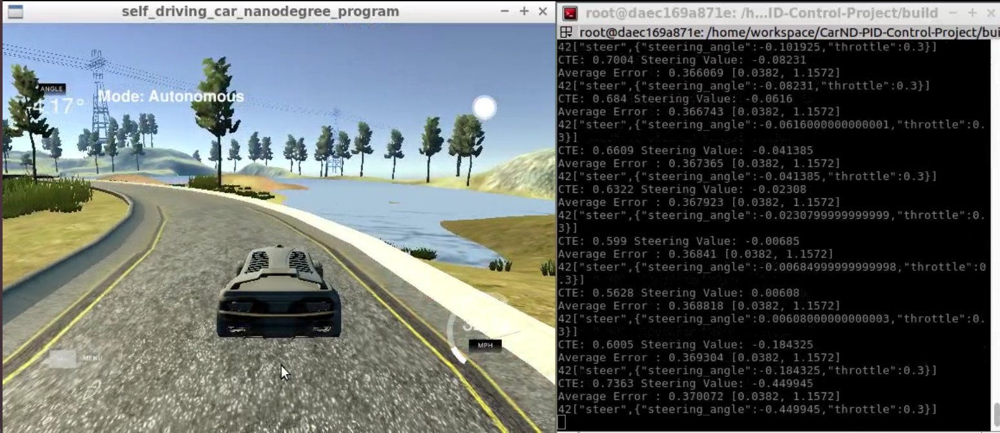

# CarND-Controls-PID
Self-Driving Car Engineer Nanodegree Program

[](http://www.udacity.com/drive)


## Overview
In this project we revisit the lake race track from the Behavioral Cloning Project. This time, I implemented a PID controller in C++ to maneuver the vehicle around the track!

The simulator provided provided by Udacity (You can download the Simulator [here](https://github.com/udacity/self-driving-car-sim/releases)).. It is provided us with the cross track error (CTE) and the velocity (mph) in order to compute the appropriate steering angle. One more thing. The speed limit has been increased from 30 mph to 100 mph.
Udacity provides a seed project to start from on this project ([here](https://github.com/udacity/CarND-PID-Control-Project)).

## Important Dependencies

The minimum project dependency versions are:

* cmake >= 3.5
 * All OSes: [click here for installation instructions](https://cmake.org/install/)
* make >= 4.1(mac, linux), 3.81(Windows)
  * Linux: make is installed by default on most Linux distros
  * Mac: [install Xcode command line tools to get make](https://developer.apple.com/xcode/features/)
  * Windows: [Click here for installation instructions](http://gnuwin32.sourceforge.net/packages/make.htm)
* gcc/g++ >= 5.4
  * Linux: gcc / g++ is installed by default on most Linux distros
  * Mac: same deal as make - [install Xcode command line tools]((https://developer.apple.com/xcode/features/)
  * Windows: recommend using [MinGW](http://www.mingw.org/)
* [uWebSockets](https://github.com/uWebSockets/uWebSockets)
  * Run either `./install-mac.sh` or `./install-ubuntu.sh`.
  * If you install from source, checkout to commit `e94b6e1`, i.e.
    ```
    git clone https://github.com/uWebSockets/uWebSockets 
    cd uWebSockets
    git checkout e94b6e1
    ```
    Some function signatures have changed in v0.14.x. See [this PR](https://github.com/udacity/CarND-MPC-Project/pull/3) for more details.
* Simulator. You can download these from the [project intro page](https://github.com/udacity/self-driving-car-sim/releases) in the classroom.

Fellow students have put together a guide to Windows set-up for the project [here](https://s3-us-west-1.amazonaws.com/udacity-selfdrivingcar/files/Kidnapped_Vehicle_Windows_Setup.pdf) if the environment you have set up for the Sensor Fusion projects does not work for this project. There's also an experimental patch for windows in this [PR](https://github.com/udacity/CarND-PID-Control-Project/pull/3).

## Project files structure
The directory structure of this repository is as follows:

```
root
|   CMakeLists.txt
|   LICENSE
|   README.md
|   cmakepatch.xt
|   install-mac.sh
|   install-ubuntu.sh
|   set_git.sh
|   
|___src
    |   json.hpp
    |   main.cpp
    |   PID.cpp
    |   PID.h
    

```

## Basic Build Instructions

Note: The project must be buildable using cmake and make!

More information is only accessible by people who are already enrolled in Term 2
of CarND. If you are enrolled, see [the project page](https://classroom.udacity.com/nanodegrees/nd013/parts/40f38239-66b6-46ec-ae68-03afd8a601c8/modules/f1820894-8322-4bb3-81aa-b26b3c6dcbaf/lessons/e8235395-22dd-4b87-88e0-d108c5e5bbf4/concepts/6a4d8d42-6a04-4aa6-b284-1697c0fd6562)
for instructions and the project rubric.

**The main program can be built and ran by doing the following from the project top directory.**

1. Clone this repo.
2. Make a build directory: `mkdir build && cd build`
3. Compile: `cmake .. && make`, this will create executable
    -  `./pid`, which is our implementation
4. Finally, run it: `./pid`. 

Alternatively some scripts have been included to streamline this process, these can be leveraged by executing the following in the top directory of the project:
```
$ ./clean.sh
$ ./build.sh
$ ./run.sh
```
Tips for setting up your environment can be found [here](https://classroom.udacity.com/nanodegrees/nd013/parts/40f38239-66b6-46ec-ae68-03afd8a601c8/modules/0949fca6-b379-42af-a919-ee50aa304e6a/lessons/f758c44c-5e40-4e01-93b5-1a82aa4e044f/concepts/23d376c7-0195-4276-bdf0-e02f1f3c665d)

## Running the Code

To run the code we need to run both `./pid.sh` using the terminal and the simulator. The output should be like:

`Listening to port 4567
`

Which means that the implemtation code now connected to the simulator right away.



Run the simulator shoud show the below image:



Using the right arrow, we need to go to our project "PID Controller":



By clicking the "Select" button, the car starts driving. The debugging information shown on the PID controller terminal. A recorded video for the final parameters could be found [here](https://github.com/aliasaswad/CarND-PID-Control-Project-P8/blob/master/results/pid_Final-with-calc_errorType.mp4).




## How to write a README
A well written README file can enhance your project and portfolio.  Develop your abilities to create professional README files by completing [this free course](https://www.udacity.com/course/writing-readmes--ud777).

